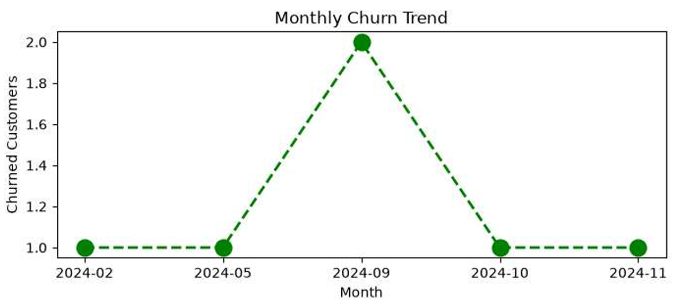

# Customer Churn Analysis

## 📊 Project Overview

This project analyzes customer churn using Python, SQL, and
data visualization techniques.

The objective is to understand customer churn patterns,
identify high-risk customer segments, and generate
business insights that can help improve customer retention.

---

## 🛠️ Tech Stack

- Python
- Pandas
- NumPy
- Matplotlib
- Seaborn
- SQLite
- Jupyter Notebook

---

customer-churn-analysis/
│
├── data/
│   └── customer_churn.db
│
├── notebooks/
│   └── Churn_analysis.ipynb
│
├── visuals/
│   ├── monthly_churn_trend.png
│   ├── churn_Rate_by_plan.png
│   ├── Churn_correlation_heatmap.png
│   └── churn_risk_analysis.png
│
├── README.md

---

## 🔍 Analysis Workflow

1. Connect to SQLite database
2. Import customer, subscription and support data
3. Perform data cleaning
4. Handle missing values
5. Standardize categorical data
6. Convert date columns
7. Perform feature engineering
8. Merge datasets
9. Perform Exploratory Data Analysis
10. Create visualizations
11. Analyze churn by different segments
12. Generate business insights

---

## 📈 Key KPIs

- Churn Rate
- Retention Rate
- ARPU
- Average Customer Tenure
- Revenue at Risk
- Escalation Rate
- Average Complaints per User

---

## 💡 Key Insights

### Overall Churn

The overall churn rate was **28.57%**,
while the retention rate was **71.43%**.

### Churn by Plan

The Basic plan had the highest churn rate at
approximately **60%**.

Premium had a churn rate of approximately
**14.29%**, while Standard had approximately
**22.22%**.

### Churn by Subscription Type

Referral customers showed the highest churn rate
among the subscription types analyzed.

### Support & Churn

The analysis found a strong positive relationship
between escalations and churn.

### Revenue at Risk

The analysis estimated approximately
**₹73.94K** in revenue at risk from churned customers.

---

## 📊 Visualizations

### Monthly Churn Trend

### Churn Rate by Plan

### Churn Correlation Heatmap

### Churn Risk Analysis

---

## 🚀 Business Recommendations

- Investigate the reasons behind high churn in the Basic plan.
- Monitor customers with high churn scores.
- Reduce customer support escalations.
- Identify customers with repeated complaints.
- Develop targeted retention strategies for high-risk customers.

---

## 📁 Files

- `Churn_analysis.ipynb` – Complete analysis
- `customer_churn.db` – SQLite database
- `exported_churn_data.csv` – Processed dataset
- `visuals/` – Analysis charts

---

## 👨‍💻 Author

Niku Kumar Yadav
